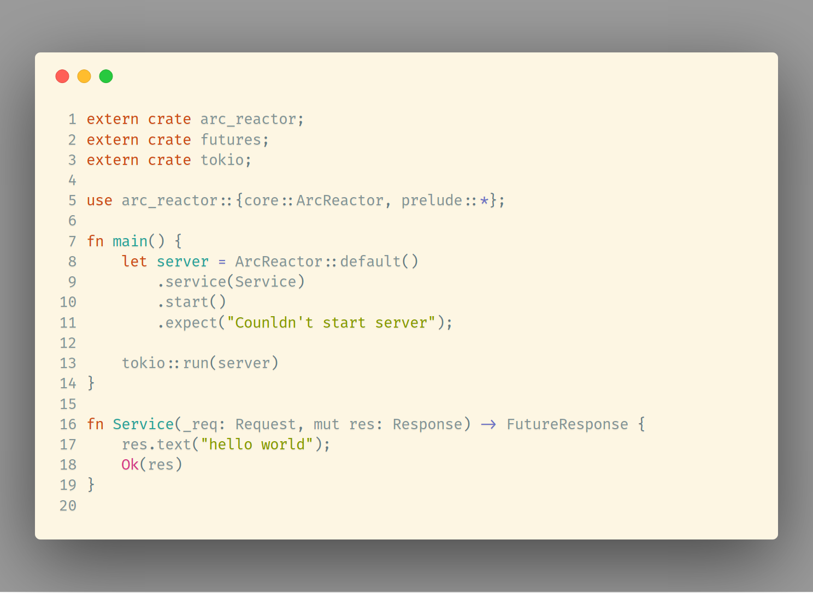

# Arc-reactor


<br/><br/>
An **Asynchronous**, **Extensible**, **Micro** web framework for Rust.

 [](https://docs.rs/arc-reactor)

## Features

- **Asynchronous**. In arc reactor, Service Handlers are asynchronous by default.

- **Integration With futures-await**. The `#[service]` proc_macro not only derives the `ArcService` trait for your route handler, but also marks it as `#[async]` so you can await on futures in your route handlers with no extra stress.

- **Intuitive Middleware System**. arc reactor exposes a middleware system that is easy to reason about. Have a look at the [design spec](./DESIGN.md)

- **Minimalistic**. arc reactor is designed to be a very thin abstraction over tokio and hyper.

- **TLS Support**. easy to add tls support.

- **Opt-in to Nightly**. arc reactor uses a lot of cool features, including `proc_macros` which are only available on the nightly channel, using the `unstable` feature flag.

## Installation

Add this to your `cargo.toml`

```toml
arc-reactor = "0.1"
```

## Hello World (default)



## Demo (unstable)


## Nightly Use

Originally, arc-reactor was designed for the nightly compiler.
But instabilities in `libprocmacro` cause it to break everytime a new nightly compiler is released.

So by default, arc-reactor no longer uses the nightly compiler, and will work out of the box with the stable compiler. 🎉
This means experimental nightly features including proc_macros are only available behind the `unstable` feature flag.

If you wish to use arc-reactor, with the nightly compiler and unstable feature enabled:
It is recommended that you lock down the compiler version. Until `libprocmacro` is stablized.

If you wish to use arc-reactor with it's default features:

- The trait `ArcService` is implemented for all functions that satisfy the signature `Fn(Request, Response) -> FutureResponse`
- The trait `MiddleWare<Request>` is implemented for all functions that satisfy the signature `Fn(Request) -> MiddleWareFuture<Request>`
- The trait `MiddleWare<Response>` is implemented for all functions that satisfy the signature `Fn(Response) -> MiddleWareFuture<Response>`
- `futures` from `futures-rs` is re-exported instead of `futures-await`.
- you lose the ability to `await!` on futures in your ServiceHandlers and MiddleWares.
- Currently, Multipart support is implemented using unstable features, so you would have to implement your own.

## Examples

Check out the examples folder and the [api documentation](https://docs.rs/arc-reactor/~0.1) to get a feel for how `arc reactor` works.
<br>
It's well documented and should get you up and running in no time.

## Design

It is Strongly recommended that you read the [design](./DESIGN.md) document, as it gives you full disclosure on arc-reactor's internals,
as well as the design decisions that were made.

## Contributions

Arc-Reactor is highly extensible via middlewares which are placed in the `contrib` module.

Some of the things are missing include:

- [ ] Logger
- [ ] Websocket
- [ ] Support byte range headers
- [x] Asynchronous StaticFileServer
- [x] Json body parser
- [x] Multipart Support

Feel free to submit a PR.

## License

Refer to [License](https://github.com/SeunLanLege/arc-reactor/blob/master/LICENSE).
